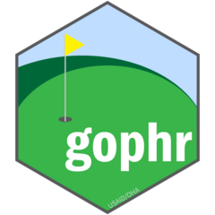

<!-- badges: start -->
[](https://github.com/USAID-OHA-SI/gophr/actions)
<!-- badges: end -->

# gophr 

## gophr
MER Structured Dataset utilities package

## Overview

The function herewithin are a set of utility functions related to working with the MER Structured Dataset and are complimented by other USAID-OHA-SI packages such as `glamr`, `glitr` and `gisr`. Focal users are analysts in USAID/GH/OHA who are using R to pull data from DATIM or perform the same repeated functions each quarter like creating TX_NET_NEW targets or assessing achievement.


## Installation

`gophr` is not on CRAN, so you will have to install it directly from GitHub using `remotes`.

If you do not have `remotes` installed, you will have to run the `install.packages("remotes")` line in the code below as well.

``` r
## SETUP

  #install package with vignettes
    install.packages("remotes")
    remotes::install_github("USAID-OHA-SI/gophr", build_vignettes = TRUE)
    
  #load the package
    library(gophr)

## LIST TYPES OF STYLES INCLUDED WITH PACKAGE
  ls(package:gophr)
```


---

*Disclaimer: The findings, interpretation, and conclusions expressed herein are those of the authors and do not necessarily reflect the views of United States Agency for International Development. All errors remain our own.*
